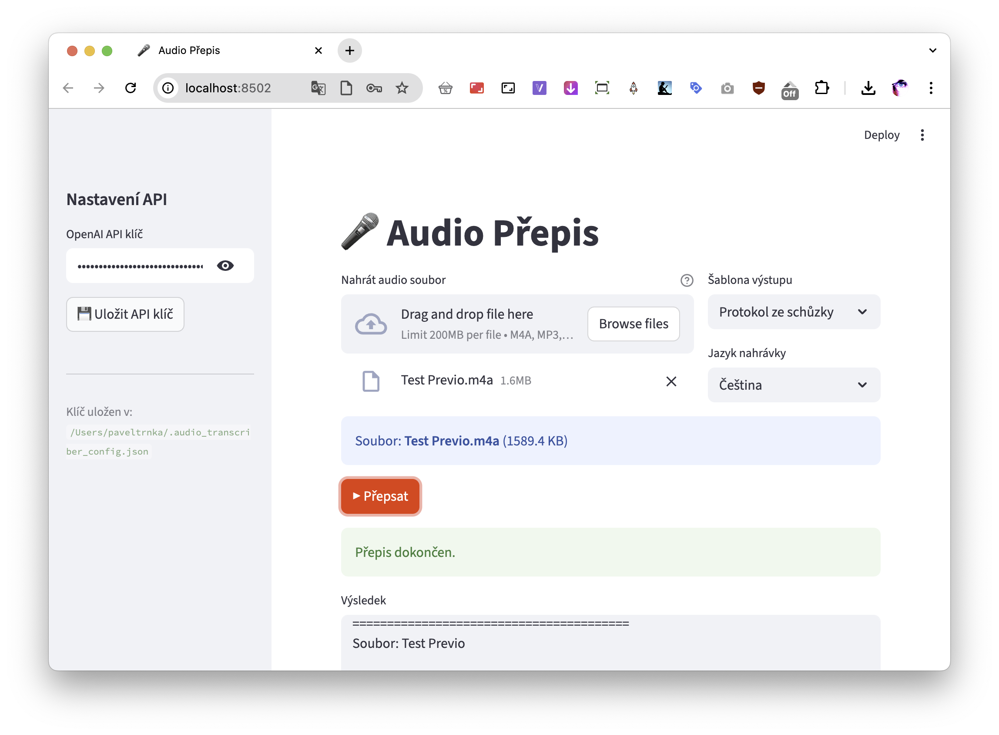

# 🎤 Audio Přepis / Audio Transcription

> **[English below](#english)** · **[Česky níže](#česky)**



---

## English

A simple web app for transcribing voice recorder audio using the OpenAI Whisper API.  
Upload a file, pick a template, download the result.

### ▶ Try it online (no install needed)

[](https://convert-audio.streamlit.app)

**[https://convert-audio.streamlit.app](https://convert-audio.streamlit.app)**

> You only need an OpenAI API key — see [how to get one](#get-an-openai-api-key).

---

### Features

- Secure API key entry (sent only to OpenAI, never stored on any server)
- Drag & drop audio upload
- 5 output templates
- Language selection
- Download result as `.txt` or `.srt`

### Output Templates

| Template | Example output |
|----------|----------------|
| Timestamps | `[01:23] Segment text` |
| Plain text | `Full transcript as one paragraph` |
| SRT subtitles | Standard subtitle format for video |
| Meeting minutes | Header + timestamps |
| Interview format | `Q: [00:05] Question` / `A: [00:12] Answer` |

### Supported formats

`m4a` `mp3` `wav` `ogg` `flac` `webm` `mp4` — Whisper API limit is **25 MB**.

---

### Get an OpenAI API key

1. Go to [platform.openai.com](https://platform.openai.com)
2. Sign up or log in
3. Navigate to **API keys** → **Create new secret key**
4. Copy the key — it's shown only once

> Pricing: ~**$0.006 per minute** of audio.  
> New accounts receive free credits.

---

### Run locally (optional)

If you prefer to run everything on your own machine:

**Step 1 — Install Python**

- **macOS:** `brew install python` (requires [Homebrew](https://brew.sh)) or download from [python.org](https://python.org/downloads)
- **Windows:** Download installer from [python.org](https://python.org/downloads) → check **"Add Python to PATH"** during install

**Step 2 — Install & run**

```bash
git clone https://github.com/trnkapavel/convert-audio.git
cd convert-audio/_prompt
pip install -r requirements.txt
streamlit run app.py
```

Opens at `http://localhost:8501`.

---

### Requirements

- OpenAI API key
- Internet connection (Whisper runs in the cloud)
- Python 3.10+ *(only for local run)*

---

### Security

Your API key is sent **only to OpenAI**. It is never stored on any server — only in your browser session (online) or locally in `~/.audio_transcriber_config.json` (local run).

---

### License

MIT

---

## Česky

Jednoduchá webová aplikace pro přepis audio nahrávek z diktafonu pomocí OpenAI Whisper API.  
Nahraješ soubor, vyběreš šablonu, stáhneš textový soubor.

### ▶ Vyzkoušet online (bez instalace)

[](https://convert-audio.streamlit.app)

**[https://convert-audio.streamlit.app](https://convert-audio.streamlit.app)**

> Potřebuješ pouze OpenAI API klíč — viz [jak ho získat](#získej-openai-api-klíč).

---

### Funkce

- Bezpečné zadání API klíče (odesílá se pouze na OpenAI, nikde se neukládá)
- Nahrávání souborů přes prohlížeč (drag & drop)
- 5 šablon výstupu
- Výběr jazyka nahrávky
- Stažení výsledku jako `.txt` nebo `.srt`

### Šablony výstupu

| Šablona | Ukázka výstupu |
|---------|----------------|
| Časová razítka | `[01:23] Text segmentu` |
| Prostý text | `Celý přepis jako jeden odstavec` |
| Titulky SRT | Standardní formát pro video titulky |
| Protokol ze schůzky | Hlavička + časová razítka |
| Interview formát | `T: [00:05] Otázka` / `R: [00:12] Odpověď` |

### Podporované formáty

`m4a` `mp3` `wav` `ogg` `flac` `webm` `mp4` — limit Whisper API je **25 MB**.

---

### Získej OpenAI API klíč

1. Jdi na [platform.openai.com](https://platform.openai.com)
2. Zaregistruj se nebo přihlas
3. V menu vyber **API keys** → **Create new secret key**
4. Klíč si zkopíruj — zobrazí se jen jednou

> Cena: přibližně **$0.006 za minutu** nahrávky.  
> Nový účet dostane kredit zdarma.

---

### Spuštění lokálně (volitelné)

Pokud chceš spustit vše na svém počítači:

**Krok 1 — Nainstaluj Python**

- **macOS:** `brew install python` (vyžaduje [Homebrew](https://brew.sh)) nebo stáhnout z [python.org](https://python.org/downloads)
- **Windows:** Stáhnout instalátor z [python.org](https://python.org/downloads) → při instalaci zaškrtnout **"Add Python to PATH"**

**Krok 2 — Nainstaluj a spusť**

```bash
git clone https://github.com/trnkapavel/convert-audio.git
cd convert-audio/_prompt
pip install -r requirements.txt
streamlit run app.py
```

Aplikace se otevře na `http://localhost:8501`.

---

### Požadavky

- OpenAI API klíč
- Internetové připojení (Whisper API je cloudová služba)
- Python 3.10+ *(pouze pro lokální spuštění)*

---

### Bezpečnost

API klíč se odesílá **pouze na OpenAI**. Nikde se neukládá na serveru — jen v relaci prohlížeče (online) nebo lokálně v `~/.audio_transcriber_config.json` (lokální spuštění).

---

### Licence

MIT
